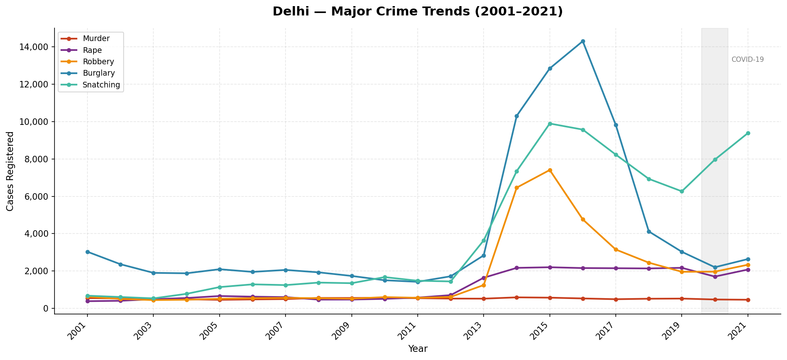
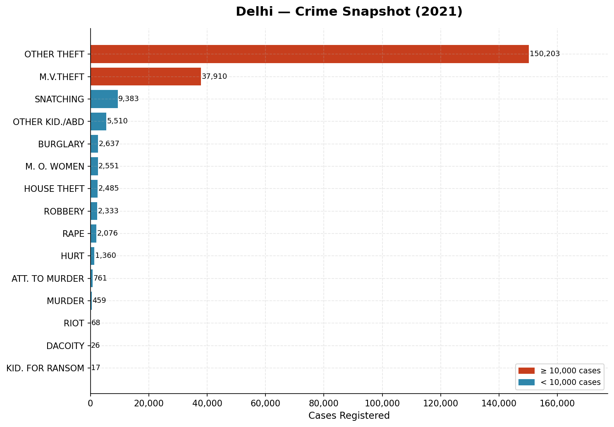
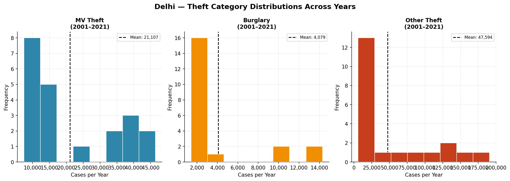
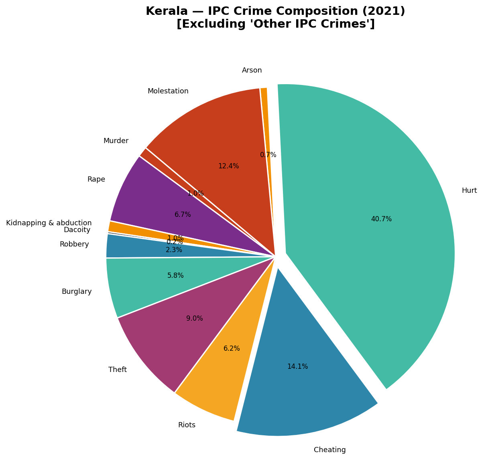

<p align="center">
  
</p>

<p align="center">
  
  
  
  
</p>

---

## 〔 About 〕

A Python project analyzing **NCRB (National Crime Records Bureau)** crime data for **Delhi** (2001–2021) and **Kerala** (2016–2021). Includes:

1. **Static Chart Generator** — 9 publication-ready matplotlib charts (line, bar, pie, histogram, heatmap, area)
2. **Interactive Predictor Dashboard** — Tkinter GUI with live search, statistical analysis, anomaly detection, and crime forecasting

> *Built as a university project at UPES — Computer Science*

---

## 〔 Features 〕

### 📊 Chart Generator (`project.py`)
Generates 9 PNG charts comparing Delhi & Kerala crime trends:

| # | Chart Type | What It Shows |
|---|-----------|--------------|
| 1 | Line | Delhi major crime trends (2001–2021) |
| 2 | Horizontal Bar | Delhi crime snapshot — 2021 |
| 3 | Histogram | Delhi theft category distributions |
| 4 | Pie | Kerala IPC crime composition — 2021 |
| 5 | Line | Kerala crimes against women |
| 6 | Stacked Bar | Kerala road accident deaths & injuries |
| 7 | Heatmap | POCSO cases by Kerala district |
| 8 | Grouped Bar | Delhi vs Kerala crime comparison |
| 9 | Area | Kerala cyber crime & missing cases |

### 🔬 Crime Predictor GUI (`gui.py`)
A Tkinter desktop app that turns raw data into actionable insights:

- **🔍 Live Search** — Filter crimes/districts as you type
- **📊 Dashboard Cards** — At-a-glance stats: prediction, latest value, average, peak year
- **⚠️ Anomaly Detection** — Auto-flags years with unusual spikes/drops (>1.5σ from mean)
- **🔮 3-Year Forecast** — Linear regression predicts future crime numbers
- **📋 Full Statistics** — Total, mean, median, std dev, CAGR, year-over-year change
- **📤 Export** — Save filtered data as CSV

---

## 〔 Datasets 〕

| Dataset | Region | Years | Rows | Source |
|---------|--------|-------|------|--------|
| `Delhi crime records.csv` | Delhi | 2001–2021 | 17 crime categories | NCRB |
| `kerala criminal cases - crimes accidents.csv` | Kerala | 2016–2021 | 69 crime categories | NCRB |
| `kerala criminal cases - POSCO ACTS(district wise).csv` | Kerala | 2016–2021 | 20 districts | NCRB |

---

## 〔 Project Structure 〕

```
Projects/
├── Py_Project/                    # Core project
│   ├── project.py                 # Chart generator (matplotlib)
│   ├── gui.py                     # Predictor dashboard (tkinter)
│   ├── Delhi crime records.csv
│   ├── kerala criminal cases  - crimes  accidents.csv
│   └── kerala criminal cases  - POSCO ACTS(district wise).csv
├── crime_dashboard/               # Streamlit web dashboard (optional)
│   ├── app.py
│   ├── requirements.txt
│   └── *.csv
├── figures/                       # Generated charts (from project.py)
├── requirements.txt
├── .gitignore
└── README.md
```

---

## 〔 Setup & Run 〕

### Prerequisites
- Python 3.10 or higher
- pip (Python package manager)

### Installation

```bash
# Clone the repository
git clone https://github.com/k-u-s-h-a-g-r-a-k-e-d-i-a/Projects.git
cd Projects

# Install dependencies
pip install -r requirements.txt
```

### Run the Chart Generator

```bash
cd Py_Project
python project.py
```
→ Saves 9 PNG charts to the `figures/` folder

### Run the Predictor Dashboard

```bash
cd Py_Project
python gui.py
```
→ Opens a desktop GUI — pick a crime, see instant predictions & stats

### Run the Streamlit Dashboard (optional)

```bash
cd crime_dashboard
pip install -r requirements.txt
streamlit run app.py
```
→ Opens at `http://localhost:8501`

---

## 〔 Libraries Used 〕

| Library | Purpose |
|---------|---------|
| `matplotlib` | Static chart generation (9 chart types) |
| `pandas` | Data loading, filtering, and manipulation |
| `numpy` | Statistical calculations, linear regression |
| `tkinter` | Desktop GUI framework (built-in with Python) |
| `streamlit` | Web dashboard (optional, for `crime_dashboard/`) |
| `plotly` | Interactive web charts (optional) |

---

## 〔 Screenshots 〕

### Chart Generator Output
| | |
|---|---|
|  |  |
|  |  |

---

## 〔 Author 〕

**Kushagra Kedia**
CS Undergraduate · University of Petroleum and Energy Studies (UPES)

<p align="center">
  
</p>
