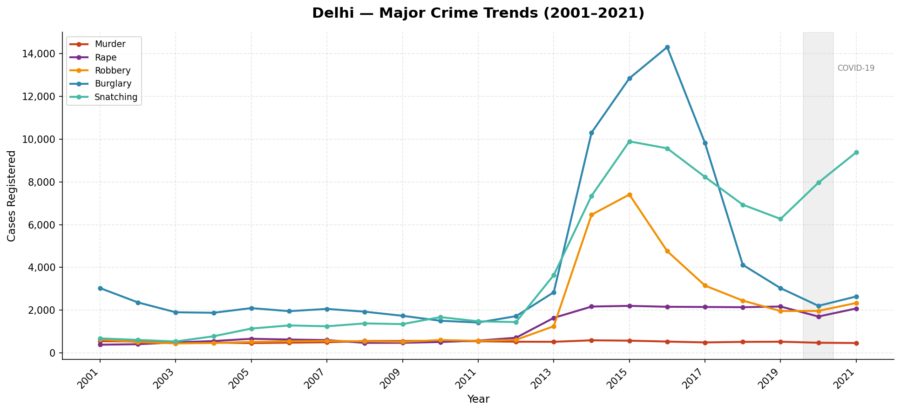
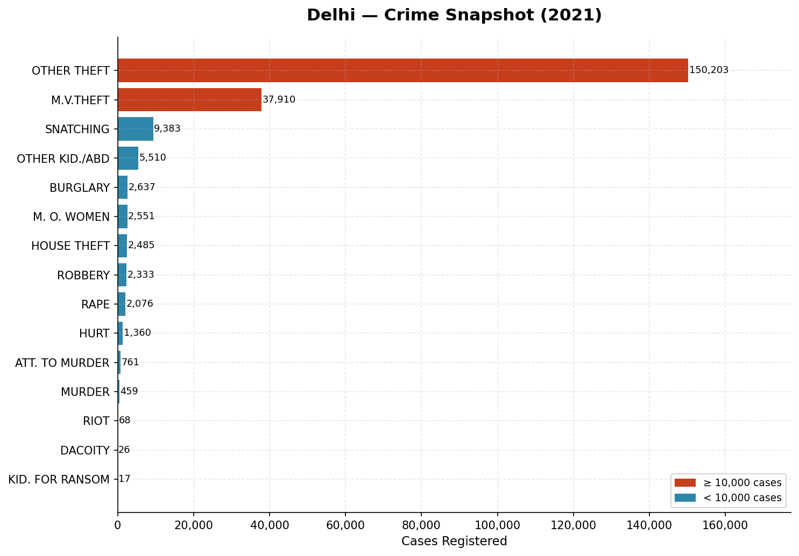
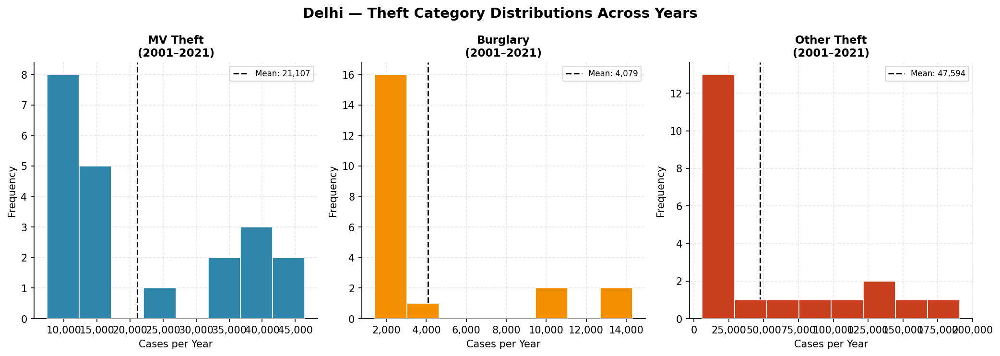
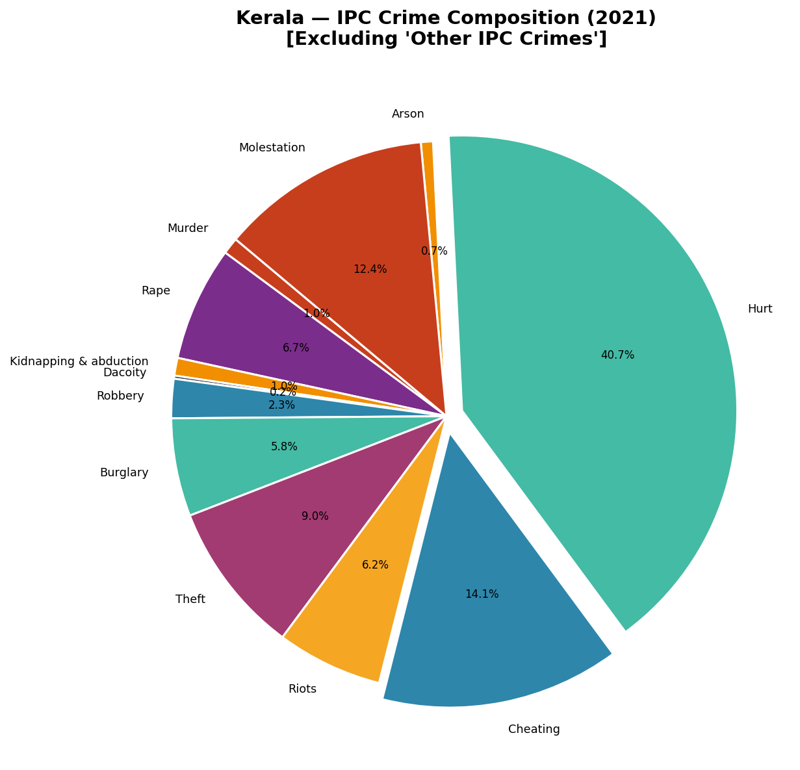

<p align="center">
  
</p>

<p align="center">
  
  
  
  
  
</p>

<p align="center">
  <em>Analytical dashboard for visualizing, exploring, and forecasting crime trends from India's National Crime Records Bureau.</em>
</p>

---

## 〔 Overview 〕

A full-stack analytics platform for **NCRB crime data** covering **Delhi** (2001–2021) and **Kerala** (2016–2021). What started as a university Python project has grown into a comprehensive crime data observatory with three interfaces:

| Interface | Tech | Purpose |
|-----------|------|---------|
| 📊 **Chart Generator** | Python + Matplotlib | 9 publication-ready static charts |
| 🔬 **Desktop Predictor** | Python + Tkinter | GUI with search, stats, anomaly detection |
| 🌐 **Web Dashboard** | Next.js + Recharts | Interactive frontend with filtering & forecasting |

> ⚠️ **Disclaimer**: This tool visualizes historical crime records for educational and research purposes. Predictions are statistical estimates based on linear regression and should not be treated as definitive forecasts.

---

## 〔 What the Data Tells 〕

```
┌─────────────────────────────────────────────────┐
│  DELHI (2001–2021)           KERALA (2016–2021)  │
│                                                   │
│  17 crime categories         69 crime categories  │
│  21 years of records         6 years of records   │
│  Theft, assault, burglary    IPC crimes, POCSO    │
│  fraud, kidnapping...        cyber, accidents...  │
│                                                   │
│  Peak year: varies by type   20 districts mapped  │
│  Anomalies: 2020 lockdown    POCSO district-wise  │
└─────────────────────────────────────────────────┘
```

---

## 〔 Features 〕

### 📊 Static Charts (`project.py`)

Nine visualization types covering different analytical angles:

| # | Chart | Description |
|---|-------|-------------|
| 1 | 📈 Line | Delhi major crime trends across two decades |
| 2 | 📊 Horizontal Bar | Crime type snapshot for Delhi — 2021 |
| 3 | 📉 Histogram | Distribution of Delhi theft sub-categories |
| 4 | 🥧 Pie | Kerala IPC crime composition — 2021 |
| 5 | 📈 Line | Kerala crimes against women over time |
| 6 | 📊 Stacked Bar | Kerala road accident fatalities vs injuries |
| 7 | 🗺️ Heatmap | POCSO cases across Kerala's 20 districts |
| 8 | 📊 Grouped Bar | Delhi vs Kerala head-to-head comparison |
| 9 | 📈 Area | Kerala cyber crime & missing persons trends |

### 🔬 Desktop Predictor (`gui.py`)

| Feature | Description |
|---------|------------|
| 🔍 Live Search | Filter crime categories as you type |
| 📋 Dashboard Cards | Prediction, latest value, average, peak year at a glance |
| ⚠️ Anomaly Detection | Flags years with values > 1.5σ from the mean |
| 🔮 3-Year Forecast | Linear regression predicting next 3 years |
| 📊 Full Stats | Total, mean, median, std dev, CAGR, year-over-year change |
| 📤 CSV Export | Save any filtered dataset to file |

### 🌐 Web Dashboard (Frontend)

| Feature | Description |
|---------|------------|
| 🗂️ Region Switching | Toggle between Delhi and Kerala datasets |
| 🔍 Multi-Filter System | Search, category multi-select, year range slider, district picker |
| 📊 Interactive Charts | Hover tooltips, click-to-detail, animated transitions |
| 🔴 Anomaly Markers | Visual indicators on charts for statistical outliers |
| 📈 Forecast Overlay | Dashed prediction line with confidence interval band |
| ⚖️ Comparison View | Side-by-side Delhi vs Kerala with synced interactions |
| 📤 Export | Download filtered data as CSV or charts as PNG |

---

## 〔 Color System 〕

The interface uses a neutral, dark analytical palette designed for prolonged data analysis:

| Role | Color | Hex |
|------|-------|-----|
| Background | ██ Midnight | `#0F1117` |
| Cards | ██ Charcoal | `#161B22` |
| Elevated | ██ Slate | `#1C2333` |
| Borders | ██ Storm | `#2D3748` |
| Primary Text | ██ Silver | `#E2E8F0` |
| Secondary Text | ██ Ash | `#A0AEC0` |
| Danger/Spike | ██ Alert Red | `#E53E3E` |
| Warning | ██ Caution Amber | `#ED8936` |
| Positive/Decline | ██ Safe Green | `#48BB78` |
| Neutral Data | ██ Intel Blue | `#4299E1` |
| Predictions | ██ Forensic Violet | `#9F7AEA` |

---

## 〔 Datasets 〕

| File | Region | Years | Scope | Source |
|------|--------|-------|-------|--------|
| `Delhi crime records.csv` | Delhi | 2001–2021 | 17 crime categories | NCRB |
| `kerala criminal cases - crimes accidents.csv` | Kerala | 2016–2021 | 69 categories | NCRB |
| `kerala criminal cases - POSCO ACTS(district wise).csv` | Kerala | 2016–2021 | 20 districts | NCRB |

---

## 〔 Project Structure 〕

```
Projects/
├── Py_Project/                         # Python core
│   ├── project.py                      # Chart generator (matplotlib)
│   ├── gui.py                          # Desktop predictor (tkinter)
│   ├── Delhi crime records.csv
│   ├── kerala criminal cases - crimes accidents.csv
│   └── kerala criminal cases - POSCO ACTS(district wise).csv
│
├── web/                                # Next.js frontend
│   ├── src/
│   │   ├── app/                        # Pages (dashboard, charts, analysis, compare)
│   │   ├── components/                 # UI components (charts, filters, cards)
│   │   ├── data/                       # Pre-processed JSON datasets
│   │   ├── lib/                        # Statistics, forecast, anomaly utilities
│   │   ├── hooks/                      # Custom React hooks
│   │   └── styles/                     # Global CSS with palette variables
│   ├── tailwind.config.js
│   └── package.json
│
├── crime_dashboard/                    # Streamlit prototype (legacy)
│   ├── app.py
│   └── requirements.txt
│
├── figures/                            # Generated PNG charts
├── docs/
│   └── SRS.md                          # Software Requirements Specification
├── requirements.txt
├── .gitignore
└── README.md
```

---

## 〔 Getting Started 〕

### Prerequisites
- **Python 3.10+** — for chart generator and desktop GUI
- **Node.js 18+** — for web frontend
- **npm** or **pnpm** — package manager

### Python Setup

```bash
git clone https://github.com/k-u-s-h-a-g-r-a-k-e-d-i-a/Projects.git
cd Projects

# Install Python dependencies
pip install -r requirements.txt

# Generate all 9 charts → saved to figures/
cd Py_Project
python project.py

# Launch desktop predictor GUI
python gui.py
```

### Web Frontend Setup

```bash
cd web

# Install dependencies
npm install

# Start development server
npm run dev
```

→ Opens at `http://localhost:3000`

### Build for Production

```bash
cd web
npm run build
npm start
```

---

## 〔 Libraries 〕

### Python
| Library | Purpose |
|---------|---------|
| `matplotlib` | Static chart generation |
| `pandas` | Data loading and manipulation |
| `numpy` | Statistics and linear regression |
| `tkinter` | Desktop GUI (built-in) |

### JavaScript / Web
| Library | Purpose |
|---------|---------|
| `next` | React framework with SSR |
| `react` | UI component model |
| `recharts` | Interactive chart components |
| `tailwindcss` | Utility-first styling |
| `zustand` | Lightweight state management |
| `html2canvas` | Chart-to-PNG export |
| `file-saver` | Client-side file downloads |

---

## 〔 Screenshots 〕

### Chart Generator Output

| | |
|---|---|
|  |  |
|  |  |

### Web Dashboard

> *Screenshots will be added after frontend implementation*

---

## 〔 Roadmap 〕

- [x] Static chart generation (9 types)
- [x] Desktop predictor GUI with anomaly detection
- [x] Streamlit prototype
- [ ] Next.js web dashboard
- [ ] Interactive chart gallery
- [ ] Delhi vs Kerala comparison view
- [ ] Forecast with confidence intervals
- [ ] CSV/PNG export from web UI
- [ ] Mobile-responsive layout

---

## 〔 License 〕

This project is built for academic purposes at UPES. Crime data sourced from [NCRB](https://ncrb.gov.in/) (public domain).

---

## 〔 Author 〕

**Kushagra Kedia**
Computer Science · University of Petroleum and Energy Studies (UPES)

<p align="center">
  <a href="https://github.com/k-u-s-h-a-g-r-a-k-e-d-i-a">
    
  </a>
</p>

<p align="center">
  
</p>
